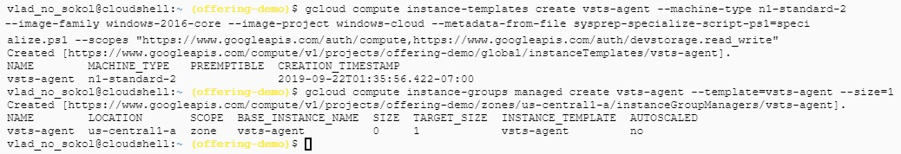
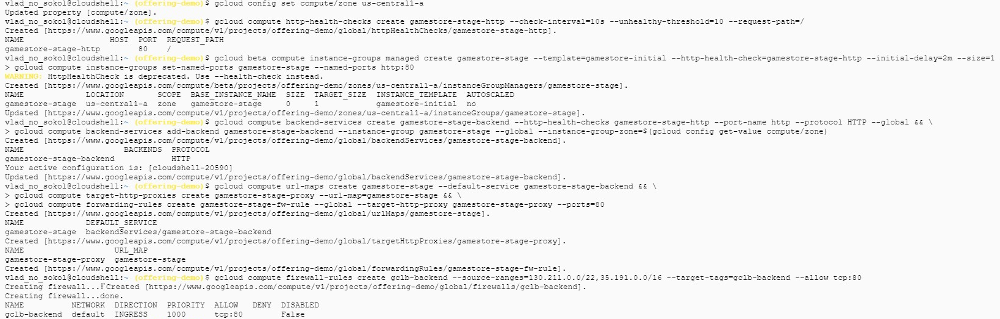
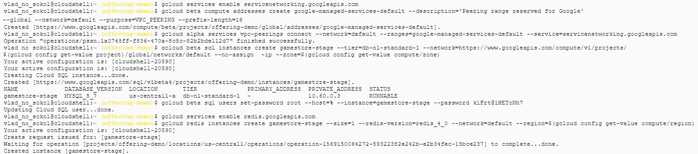
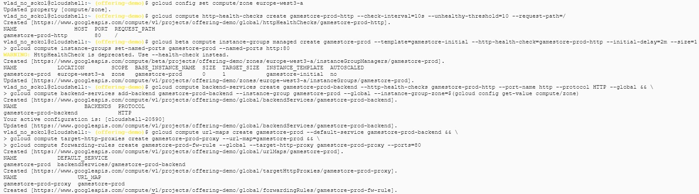
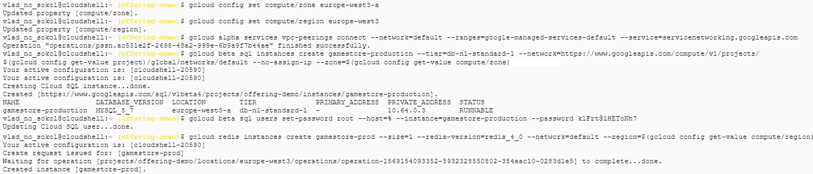
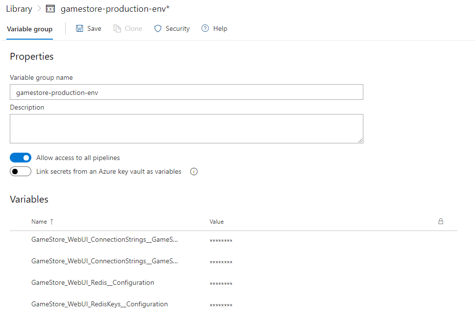
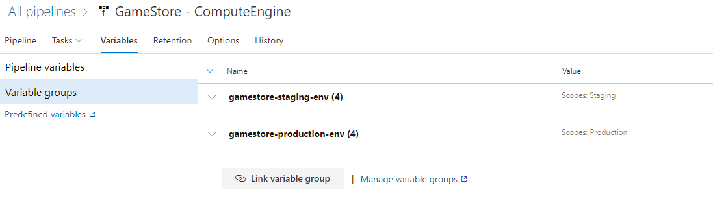
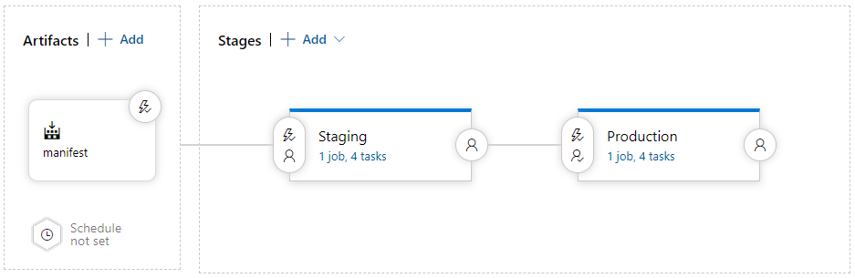
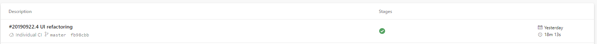
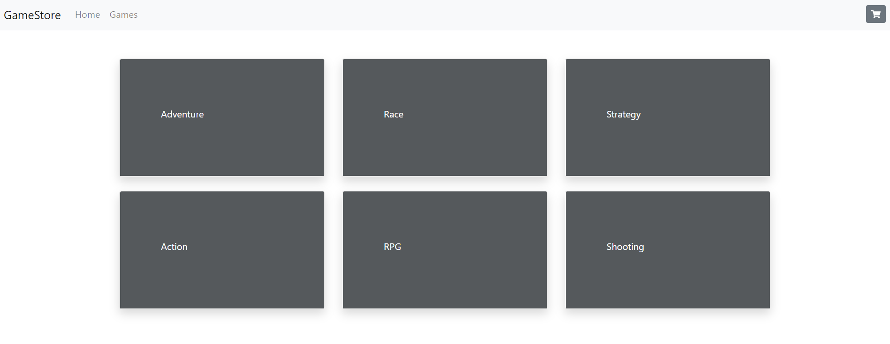

# Step by step guide

[](https://dev.azure.com/sweewo/OfferingDemo/_apis/build/status/13)

- [Step by step guide](#step-by-step-guide)
    - [Requirements](#requirements)
    - [Configuring GCP staging & production environment](#configuring-gcp-staging--production-environment)
        - [Configure agent](#configure-agent)
        - [Configure the staging environment](#configure-the-staging-environment)
            - [Configure application services](#configure-application-services)
            - [Configure data management services](#configure-data-management-services)
        - [Configure the production environment](#configure-the-production-environment)
            - [Configure application services](#configure-application-services-1)
            - [Configure data management services](#configure-data-management-services-1)
    - [Configuring AzureDevops pipeline](#configuring-azuredevops-pipeline)
        - [Creating an Azure DevOps project](#creating-an-azure-devops-project)
        - [Building continuously](#building-continuously)
        - [Deploying continuously](#deploying-continuously)
            - [Storing env variables](#storing-env-variables)
            - [Deploying the staging environment](#deploying-the-staging-environment)
            - [Deploying the production environment](#deploying-the-production-environment)
            - [Running the pipeline](#running-the-pipeline)

## Requirements

To go through this step by step guide you will need a few things:
- AzureDevops account
- Google account

## Configuring GCP staging & production environment

### Configure agent

Initialize an environment variables:
```bash
gcloud services enable compute.googleapis.com
export AZURE_DEVOPS_AGENT_URL=[AGENT-DOWNLOAD-URL]
export AZURE_DEVOPS_TOKEN=[YOUR-SECURITY-TOKEN]
export AZURE_DEVOPS_URL=https://[ACCOUNT].visualstudio.com
```

Create startup script on powershell:
<details>
<summary>specialize.ps1</summary>
<p>

```powershell
cat | envsubst '$AZURE_DEVOPS_AGENT_URL $AZURE_DEVOPS_TOKEN $AZURE_DEVOPS_URL' > specialize.ps1 << 'EOF'
# Create an installation directory for the Azure Pipelines agent
New-Item -ItemType directory -Path $env:programfiles\vsts-agent

# Create a work directory for the Azure Pipelines agent
New-Item -ItemType directory -Path $env:programdata\vsts-agent

# Download and install the Azure Pipelines agent package
Invoke-WebRequest `
  -Uri "$AZURE_DEVOPS_AGENT_URL" `
  -OutFile $env:TEMP\vsts-agent.zip
Add-Type -AssemblyName System.IO.Compression.FileSystem
[System.IO.Compression.ZipFile]::ExtractToDirectory( `
  "$env:TEMP\vsts-agent.zip", `
  "$env:programfiles\vsts-agent")

# Download and install Packer
[Net.ServicePointManager]::SecurityProtocol = [Net.SecurityProtocolType]::Tls12
Invoke-WebRequest `
  -Uri "https://releases.hashicorp.com/packer/1.2.2/packer_1.2.2_windows_amd64.zip" `
  -OutFile $env:TEMP\packer.zip
[System.IO.Compression.ZipFile]::ExtractToDirectory( `
  "$env:TEMP\packer.zip", `
  "$env:programfiles\packer")

# Download and install the Cloud SDK
Invoke-WebRequest `
  -Uri https://dl.google.com/dl/cloudsdk/channels/rapid/GoogleCloudSDKInstaller.exe `
  -OutFile $env:TEMP\cloudsdk.exe
Start-Process -Wait $env:TEMP\cloudsdk.exe -arg "/S /noreporting /nostartmenu /nodesktop"

# Add Packer and the Cloud SDK installation directory to global path
[Environment]::SetEnvironmentVariable( `
  "Path", $env:Path + ";$env:programfiles\packer;${env:ProgramFiles(x86)}\Google\Cloud SDK\google-cloud-sdk\bin", `
  [System.EnvironmentVariableTarget]::Machine)

# Install gcloud beta commands
$env:CLOUDSDK_PYTHON=gcloud components copy-bundled-python
Start-Process -Wait gcloud -arg "components install beta --quiet"

# Configure the Azure Pipelines agent
& $env:programfiles\vsts-agent\bin\Agent.Listener configure `
  --url $AZURE_DEVOPS_URL `
  --agent "GCE Agent" `
  --work $env:programdata\vsts-agent `
  --pool "Google Cloud" `
  --replace `
  --runAsService `
  --windowsLogonAccount "NT AUTHORITY\NETWORK SERVICE" `
  --auth PAT `
  --token $AZURE_DEVOPS_TOKEN
EOF
```
</p>
</details>

We will get something like that:
<details>
<summary>Logs</summary>
<p>


</p>
</details>

Create agent template and intance group:
```bash
gcloud compute instance-templates create vsts-agent --machine-type n1-standard-2 --image-family windows-2016-core --image-project windows-cloud --metadata-from-file sysprep-specialize-script-ps1=specialize.ps1 --scopes "https://www.googleapis.com/auth/compute,https://www.googleapis.com/auth/devstorage.read_write"
gcloud compute instance-groups managed create vsts-agent --template=vsts-agent --size=1
```
<details>
<summary>Logs</summary>
<p>


</p>
</details>

Create a Cloud Storage bucket for build artifacts:
```bash
gcloud config set compute/zone us-central1-a
gsutil mb gs://$(gcloud config get-value core/project)-artifacts
```

### Configure the staging environment

#### Configure application services

1. Set default values for Compute Engine zone and region
   ```bash
   gcloud config set compute/zone us-central1-a
   gcloud config set compute/region us-central1
   ```
2. Create an instance template that uses a standard Windows Server 2016 Core image.
   ```bash
   gcloud compute instance-templates create gamestore-initial --machine-type n1-standard-2 --image-family windows-2016-core --image-project windows-cloud --boot-disk-type pd-ssd
   ```
3. Create an HTTP health check.
   ```bash
   gcloud compute http-health-checks create gamestore-stage-http --check-interval=10s --unhealthy-threshold=10 --request-path=/
   ```
4. Create a managed instance group that's based on the initial instance template.
   ```bash
   gcloud beta compute instance-groups managed create gamestore-stage --template=gamestore-initial --http-health-check=gamestore-stage-http --initial-delay=2m --size=1 && \
   gcloud compute instance-groups set-named-ports gamestore-stage --named-ports http:80
   ```
5. Create a load balancer backend service that uses the HTTP health check and managed instance group that you created previously:
   ```bash
   gcloud compute backend-services create gamestore-stage-backend --http-health-checks gamestore-stage-http --port-name http --protocol HTTP --global && \
   gcloud compute backend-services add-backend gamestore-stage-backend --instance-group gamestore-stage --global --instance-group-zone=$(gcloud config get-value compute/zone)
   ```
6. Create a load balancer frontend:
   ```bash
   gcloud compute url-maps create gamestore-stage --default-service gamestore-stage-backend && \
   gcloud compute target-http-proxies create gamestore-stage-proxy --url-map=gamestore-stage && \
   gcloud compute forwarding-rules create gamestore-stage-fw-rule --global --target-http-proxy gamestore-stage-proxy --ports=80
   ```
7. Create a firewall rule that allows the Google load balancer to send HTTP requests to instances that have been annotated with the gclb-backend tag.
   ```bash
   gcloud compute firewall-rules create gclb-backend --source-ranges=130.211.0.0/22,35.191.0.0/16 --target-tags=gclb-backend --allow tcp:80
   ```
<details>
<summary>Logs</summary>
<p>


</p>
</details>

#### Configure data management services

1. Create a private connection
   ```bash
   gcloud services enable servicenetworking.googleapis.com
   gcloud beta compute addresses create google-managed-services-default --description='Peering range reserved for Google' --global --network=default --purpose=VPC_PEERING --prefix-length=16
   gcloud alpha services vpc-peerings connect --network=default --ranges=google-managed-services-default --service=servicenetworking.googleapis.com
   ```
2. Create a SQL instance 
   ```bash
   gcloud beta sql instances create gamestore-stage --tier=db-n1-standard-1 --network=https://www.googleapis.com/compute/v1/projects/$(gcloud config get-value project)/global/networks/default --no-assign-ip --zone=$(gcloud config get-value compute/zone)
   gcloud beta sql users set-password root --host=% --instance=gamestore-stage --password <some-pass>
   ```
3. Create a Memorystore instance
   ```bash
   gcloud services enable redis.googleapis.com
   gcloud redis instances create gamestore-stage --size=1 --redis-version=redis_4_0 --network=default --region=$(gcloud config get-value compute/region)
   ```
<details>
<summary>Logs</summary>
<p>


</p>
</details>

### Configure the production environment

#### Configure application services

1. Set default values for Compute Engine zone and region
   ```bash
   gcloud config set compute/zone europe-west3-a
   gcloud config set compute/region europe-west3
   ```
2. Create an HTTP health check.
   ```bash
   gcloud compute http-health-checks create gamestore-prod-http --check-interval=10s --unhealthy-threshold=10 --request-path=/
   ```
3. Create a managed instance group that's based on the initial instance template.
   ```bash
   gcloud beta compute instance-groups managed create gamestore-prod --template=gamestore-initial --http-health-check=gamestore-prod-http --initial-delay=2m --size=1 && \
   gcloud compute instance-groups set-named-ports gamestore-prod --named-ports http:80
   ```
4. Create a load balancer backend service that uses the HTTP health check and managed instance group that you created previously:
   ```bash
   gcloud compute backend-services create gamestore-prod-backend --http-health-checks gamestore-prod-http --port-name http --protocol HTTP --global && \
   gcloud compute backend-services add-backend gamestore-prod-backend --instance-group gamestore-prod --global --instance-group-zone=$(gcloud config get-value compute/zone)
   ```
5. Create a load balancer frontend:
   ```bash
   gcloud compute url-maps create gamestore-prod --default-service gamestore-prod-backend && \
   gcloud compute target-http-proxies create gamestore-prod-proxy --url-map=gamestore-prod && \
   gcloud compute forwarding-rules create gamestore-prod-fw-rule --global --target-http-proxy gamestore-prod-proxy --ports=80
   ```
<details>
<summary>Logs</summary>
<p>


</p>
</details>

#### Configure data management services

1. Create a private connection
   ```bash
   gcloud alpha services vpc-peerings connect --network=default --ranges=google-managed-services-default --service=servicenetworking.googleapis.com
   ```
2. Create a SQL instance 
   ```bash
   gcloud beta sql instances create gamestore-production --tier=db-n1-standard-1 --network=https://www.googleapis.com/compute/v1/projects/$(gcloud config get-value project)/global/networks/default --no-assign-ip --zone=$(gcloud config get-value compute/zone)
   gcloud beta sql users set-password root --host=% --instance=gamestore-production --password <some-pass>
   ```
3. Create a Memorystore instance
   ```bash
   gcloud redis instances create gamestore-prod --size=1 --redis-version=redis_4_0 --network=default --region=$(gcloud config get-value compute/region)
   ```
<details>
<summary>Logs</summary>
<p>


</p>
</details>

## Configuring AzureDevops pipeline

### Creating an Azure DevOps project

Using [GameStore](https://github.com/sweewo-v/GameStore) as an example, you will use Azure Pipelines to manage the source code, run builds and tests, and orchestrate the deployment to Google Compute Engine.

To begin, create a new project in your Azure DevOps account:

1. Go to the Azure DevOps home page (https://dev.azure.com/[ACCOUNT]).
1. Click <b>Create Project</b>.
1. Enter a project name, such as <b>GameStore</b>.
1. Set Visibility to Private, and then click <b>Create</b>.
1. After the project has been created, in the menu on the left, click <b>Repos</b>.
1. Click Import to fork the GameStore repository from GitHub. Set the following values:

   - Source type: Git
   - Clone URL: https://github.com/sweewo-v/GameStore.git
   - Leave the Requires authorization checkbox unselected.
   
1. Click <b>Import</b>. When the import process is done, you see the source code for GameStore.

### Building continuously

1. In the Azure DevOps menu, select <b>Pipelines</b>.
1. Click <b>New pipeline</b>.
1. Select <b>Azure Repos Git > GameStore</b>.
1. Select <b>Existing Azure Pipelines YAML file</b>.
1. Specify <i>Path</i> as <b>[/gcp-compute-engine/azure-build-pipeline.yml](../azure-build-pipeline.yml)</b>.

1. Click <b>Continue</b> and <b>Run</b>.

### Deploying continuously

1. In the Azure DevOps menu, select <b>Pipelines > Releases</b>.
1. Click <b>New release pipeline</b>.
1. From the list of templates, select <b>Empty job</b>.
1. When you're prompted for a name for the stage, enter <i>Stage</i>.
1. In the pipeline diagram, next to Artifacts, click <b>Add</b>.
1. Select Build and add the following settings:
   - Source: Select early created Git repository.
   - Default version: <i>Latest</i>.
   - Source alias: <i>manifest</i>.
   - Click <b>Add</b>.

1. On the Artifact box, click the lightning bolt icon to add a deployment trigger.
1. Under Continuous deployment trigger, set the switch to <b>Enabled</b>.
1. Click <b>Save</b>.
1. Enter a comment if you want, and confirm by clicking <b>Save</b>.

#### Storing env variables

1. In the Azure DevOps menu, select <b>Pipelines > Library</b>.
1. Click create variable group.
1. Configure the following setting:
   
   - Variable group name: gamestore-staging-env
   - Variables:

       |Name|Value|
       |---|---|
       |GameStore_WebUI_ConnectionStrings__GameStoreDatabase|Connection string to gamestore db|
       |GameStore_WebUI_ConnectionStrings__GameStoreIdentityDatabase|Connection string to gamestore identity db|
       |GameStore_WebUI_Redis__Configuration|Connection string to Redis caching|
       |GameStore_WebUI_RedisKeys__Configuration|Connection string to Redis keys storage|

1. Repeat previous step but with specific <i>Variable group name</i> : gamestore-production-env.

You will get something like this:


#### Deploying the staging environment

1. In Azure Pipelines, switch to the <b>Tasks</b> tab.
1. Click Agent job.
1. Change the agent pool to <b>Private > Google Cloud</b>.
1. Next to Agent job, click the + icon to add a step to the phase.
1. Select the PowerShell task, click <b>Add</b>, and configure the following settings:
   - Version: 2.*
   - Display name: Create startup script file
   - Type: File Path
   - Script Path: $(System.DefaultWorkingDirectory)/manifest/GameStore/create-startup-script.ps1
   - Working Directory: $(System.DefaultWorkingDirectory)/manifest/GameStore
1. Select the Command Line task, click <b>Add</b>, and configure the following settings:
   - Version: 1.*
   - Display name: Create instance template
   - Tool: gcloud
   - Arguments: ``compute instance-templates create gamestore-$(Build.BuildId)-$(Release.ReleaseId)-stage --machine-type n1-standard-2 --image gamestore-$(Build.BuildId) --image-project $(Packer.Project) --tags=gclb-backend --metadata-from-file windows-startup-script-ps1=script.ps1``

   This command creates a new instance template that uses the VM image that you previously built with Packer. The command applies the gclb-backend tag so that the load balancer can reach instances that are created from this template.
1. Add another Command Line task and configure the following settings:
   - Version: 1.*
   - Display name: Associate instance template
   - Tool: gcloud
   - Arguments: ``beta compute instance-groups managed set-instance-template gamestore-stage --template=gamestore-$(Build.BuildId)-$(Release.ReleaseId)-stage --zone $(Deployment.Stage.Zone)``

   This command updates the existing instance group to use the new instance template. Note that this command does not yet cause any of the existing VMs to be replaced or updated. Instead, it ensures that any future VMs in this instance group are created from the new template.
1. Add another Command Line task and configure the following settings:
   - Version: 1.*
   - Display name: Start rolling update
   - Tool: gcloud
   - Arguments: ``beta compute instance-groups managed rolling-action start-update gamestore-stage --version template=gamestore-$(Build.BuildId)-$(Release.ReleaseId)-stage --type proactive --min-ready 2m --max-unavailable 0 --zone $(Deployment.Stage.Zone)``

   This command causes the existing instance group to replace existing VMs with new VMs in a rolling fashion.
1. Click the Variables tab, and add the following variables:

   |Name|Value|
   |---|---|
   |Packer.Project|The name of your GCP project|
   |Deployment.Stage.Zone|The zone that you specified earlier when running gcloud config set compute/zone|
1. Click the Variable Group and link previously created variables groups:
   
1. Click Save.
1. Enter a comment if you want, and confirm by clicking OK.

#### Deploying the production environment

1. In Azure Pipelines, switch to the <b>Pipeline</b> tab.
1. In the Stages box, select <b>Add > New stage</b>.
1. From the list of templates, select <b>Empty job</b>.
1. When you're prompted for a name for the stage, enter <i>Prod</i>.
1. Click the lightning bolt icon of the newly created stage.
1. Configure the following settings:
   - Select trigger: After stage
   - Stages: Staging
   - Pre-deployment approvals: (enabled)
   - Approvers: Select your own user name.
1. Hold the mouse over the Tasks tab and click <b>Tasks > Prod</b>.
1. Click <b>Agent job</b>.
1. Change the Agent pool value to <b>Private > Google Cloud</b>.
1. Next to Agent phase, click the + icon to add a step to the phase.
1. Select the PowerShell task, click <b>Add</b>, and configure the following settings:
   - Version: 2.*
   - Display name: Create startup script file
   - Type: File Path
   - Script Path: $(System.DefaultWorkingDirectory)/manifest/GameStore/create-startup-script.ps1
   - Working Directory: $(System.DefaultWorkingDirectory)/manifest/GameStore
1. Select the Command Line task, click <b>Add</b>, and configure the following settings:
   - Version: 1.*
   - Display name: Create instance template
   - Tool: gcloud
   - Arguments: ``compute instance-templates create gamestore-$(Build.BuildId)-$(Release.ReleaseId)-prod --machine-type n1-standard-2 --image gamestore-$(Build.BuildId) --image-project $(Packer.Project) --tags=gclb-backend --metadata-from-file windows-startup-script-ps1=script.ps1``

   This command creates a new instance template that uses the VM image that you previously built with Packer. The command applies the gclb-backend tag so that the load balancer can reach instances that are created from this template.
1. Add another Command Line task and configure the following settings:
   - Version: 1.*
   - Display name: Associate instance template
   - Tool: gcloud
   - Arguments: ``beta compute instance-groups managed set-instance-template gamestore-prod --template=gamestore-$(Build.BuildId)-$(Release.ReleaseId)-prod --zone $(Deployment.Prod.Zone)``

   This command updates the existing instance group to use the new instance template. Note that this command does not yet cause any of the existing VMs to be replaced or updated. Instead, it ensures that any future VMs in this instance group are created from the new template.
1. Add another Command Line task and configure the following settings:
   - Version: 1.*
   - Display name: Start rolling update
   - Tool: gcloud
   - Arguments: ``beta compute instance-groups managed rolling-action start-update gamestore-prod --version template=gamestore-$(Build.BuildId)-$(Release.ReleaseId)-prod --type proactive --min-ready 2m --max-unavailable 0 --zone $(Deployment.Prod.Zone)``

   This command causes the existing instance group to replace existing VMs with new VMs in a rolling fashion.
1. Switch to the Variables tab.
1. Add a variable:

   |Name|Value|
   |---|---|
   |Deployment.Prod.Zone|The zone that you specified earlier when running gcloud config set compute/zone|
1. Click <b>Save</b>.
1. Enter a comment if you want, and confirm by clicking <b>OK</b>.

The pipeline now looks like this:


#### Running the pipeline

1. Now you can just make some changes to source code and commit it. Your pipeline will start executing immediately:

   
   

1. In Cloud Shell, run the following command to obtain the IP address of the load balancer for the staging environment:
   ```bash
   gcloud compute forwarding-rules list | grep gamestore-stage | awk '{print $2}'
   ```

1. In the browser, go to the GameStore URL that you got in the previous step:
   ```bash
   http://[STAGE_IP]/gamestore/
   ```

1. In Azure Pipelines, below the Production stage, click Approve to trigger the deployment to the production environmentю

1. In Cloud Shell, run the following command to obtain the IP address of the load balancer for the production environment:
   ```bash
   gcloud compute forwarding-rules list | grep gamestore-prod | awk '{print $2}'
   ```

1. In the browser, go to the GameStore URL that you got in the previous step:
   ```bash
   http://[PROD_IP]/gamestore/
   ```

1. When it’s ready, observe that GameStore has been deployed successfully:
   

