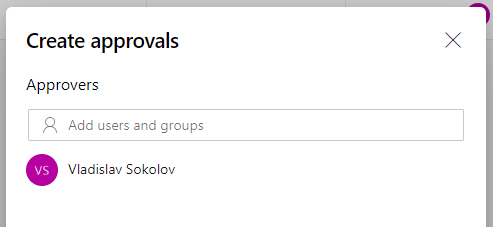
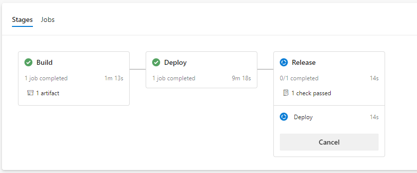
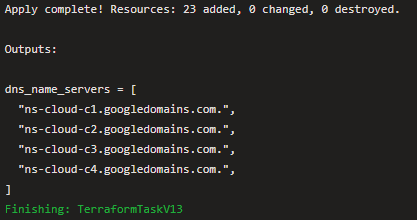

# Step by step guide

[](https://dev.azure.com/sweewo/OfferingDemo/_apis/build/status/15)

- [Step by step guide](#step-by-step-guide)
    - [Requirements](#requirements)
    - [Configuring GCP project](#configuring-gcp-project)
        - [Configure bucket](#configure-bucket)
    - [Configuring AzureDevops pipeline](#configuring-azuredevops-pipeline)
        - [Configure source git](#configure-source-git)
        - [Configure terraform extension](#configure-terraform-extension)
        - [Building and deploying continuously](#building-and-deploying-continuously)
        - [Deploying continuously](#deploying-continuously)
    - [Cleaning up:](#cleaning-up)

## Requirements

To go through this step by step guide you will need a few things:
- AzureDevops account
- Google account
- Available DNS

## Configuring GCP project

### Configure bucket

To store terraform state we will be using Google Storage:

```bash
gsutil mb -l us-central1 -b on gs://[BUCKET_NAME]/
```

Enable next google api's:

```bash
gcloud services enable servicenetworking.googleapis.com
gcloud services enable cloudresourcemanager.googleapis.com
gcloud services enable compute.googleapis.com
gcloud services enable sqladmin.googleapis.com
gcloud services enable redis.googleapis.com
gcloud services enable serviceusage.googleapis.com
gcloud services enable dns.googleapis.com
```

## Configuring AzureDevops pipeline

### Configure source git

Using [GameStore](https://github.com/sweewo-v/GameStore) as an example, you will use Azure Pipelines to manage the source code, run builds and orchestrate the deployment to Google Compute Engine.

To begin, create a new project in your Azure DevOps account:

1. Go to the Azure DevOps home page (https://dev.azure.com/[ACCOUNT]).
1. Click <b>Create Project</b>.
1. Enter a project name, such as <b>GameStore</b>.
1. Set Visibility to Private, and then click <b>Create</b>.
1. After the project has been created, in the menu on the left, click <b>Repos</b>.
1. Click Import to fork the GameStore repository from GitHub. Set the following values:

   - Source type: Git
   
   - Clone URL: https://github.com/sweewo-v/GameStore.git
   
   - Leave the Requires authorization checkbox unselected.
   
1. Click <b>Import</b>. When the import process is done, you see the source code for GameStore.

### Configure terraform extension
To use prepared pipeline you will need:
1. Install [extension](https://marketplace.visualstudio.com/items?itemName=ms-devlabs.custom-terraform-tasks) for Azure DevOps. 

1. Create service connection to GCP.

### Building and deploying continuously

1. In the Azure DevOps menu, select <b>Pipelines</b>.

1. Click <b>New pipeline</b>.
1. Select <b>Azure Repos Git > GameStore</b>.
1. Select <b>Existing Azure Pipelines YAML file</b>.
1. Specify <i>Path</i> as <b>[/terraform/azure-pipelines.yml](../azure-pipelines.yml)</b>.
1. Change pipeline values:

    |Name|Value|
    |---|---|
    |bucket|bucket name that you have created earlier|

1. Click <b>Continue</b> and <b>Run</b>.

### Deploying continuously

In this pipeline i have added deploying stage's to build pipeline.
If you want to add approvals to Production stage:

1. In the Azure DevOps menu, select <b>Pipelines > Environments</b>.
1. Click <b>gamestore-production</b>.
1. Go to <b>Checks</b> and create one:

   

You wiil get something like that:



After finishing Release stage go to logs and find output of last command:



Add this name servers to your dns configuration.

Wait until GCP sertificate provisioning will finish:


## Cleaning up

To clean up all created by terraform resources:

1. Install terraform locally

2. Download service account key in json format:
  ```powershell
  $env:GOOGLE_APPLICATION_CREDENTIALS=[PATH_TO_CREDENTIALS]
  ```
3. Run terraform init command with backend configuration properties:
  ```powershell
  terraform init -backend-config=[BUCKET_NAME] -backend-config="prefix=terraform/staging"
  ```
4. Run terraform destroy command:
  ```powershell
  terraform destroy
  ```
